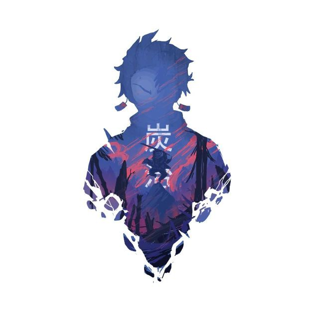

### Heyyo! It's me Bakachii(Tanji)

 

**Statistics**

<code></code>
<code></code>
<code></code>    
<code></code>

|  |  |
| ------------- | ------------- |

### Best Repositories 

#### Extras

 

